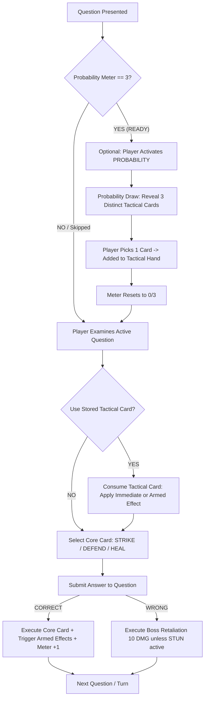
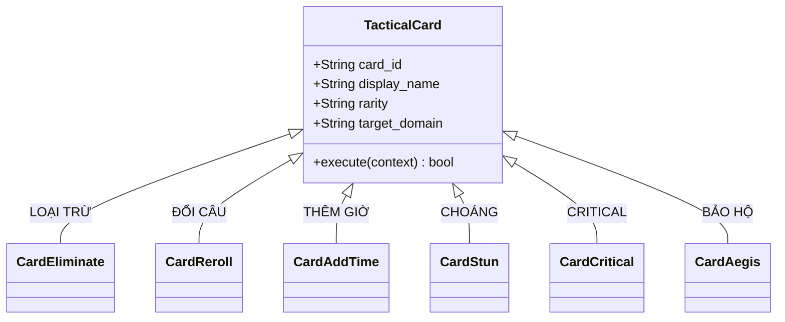
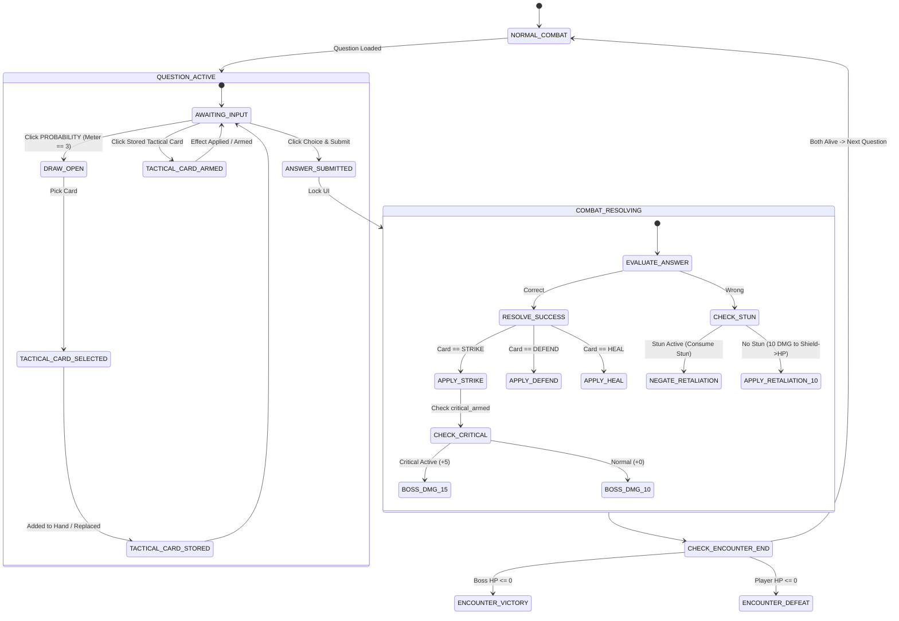

# V1 Gameplay Contract: PROBABILITY Tactical Card Gacha System

- **Document ID**: `MATHOS-PROBABILITY-GACHA-CONTRACT-230A`
- **Version**: `1.0.0-PROD-CONTRACT`
- **Owner**: Agent1 (Prologue Production Implementation Owner)
- **Status**: APPROVED CONTRACT / READY FOR IMPLEMENTATION
- **System Scope**: Combat System (`res://src/gameplay/combat/`, `res://src/ui/combat/`, `res://src/ui/question/`)

---

## 1. Executive Summary & Gacha Philosophy

In Mathos, the **PROBABILITY (Xác Suất)** card is **not** a standard direct-damage, shield, or heal card. Instead, it functions as a **Tactical Gacha System** designed to reward mathematical consistency with powerful, flexible tactical choices.

### 1.1 Non-Monetized Combat Gacha Philosophy
1. **Zero Monetization**: This system does **not** involve real money, microtransactions, premium currencies, or pay-to-win mechanics.
2. **Combat-Earned Momentum**: Charges are earned strictly through answering curriculum math questions correctly during active combat encounters.
3. **Tactical Agency vs. Extreme RNG**:
   - Randomness creates **situational variety** and encourages adapting playstyles, but does **not** determine encounter victory or failure.
   - Base combat (`STRIKE = 10`, `DEFEND = +8 Shield`, `HEAL = +15 HP`) remains fully viable and mathematically beatable without ever using the Probability card.
   - The draw offers a **"Pick 1 of 3"** drafting mechanic, giving the player strategic control over which utility best addresses their current board state.

---

## 2. Core Loop & Base Combat Preservation

### 2.1 Base Combat Contract (Strict Invariance)
The base combat triad and enemy retaliation mechanics are immutable:
- **STRIKE**: Deals exactly **10 Boss DMG** to STOCHAS on correct answer.
- **DEFEND**: Grants exactly **+8 Shield** to the Player on correct answer.
- **HEAL**: Restores exactly **+15 HP** to the Player on correct answer (capped at `max_hp = 100`).
- **Wrong-Answer Retaliation**: STOCHAS attacks with **10 DMG**, resolved sequentially against **Shield -> HP**.
- **PROBABILITY does NOT replace the base triad**: Activating a Probability Draw or using a stored Tactical Card does **not** consume the player's core combat action for the turn. The player still chooses `STRIKE`, `DEFEND`, or `HEAL` and solves the active question.

### 2.2 Core Gameplay Flowchart


---

## 3. Probability Meter Economy

### 3.1 Meter Specifications
- **Capacity**: Maximum **3 Charges** (`0/3`, `1/3`, `2/3`, `3/3`).
- **Default Gain Rule**:
  - Each **Correct Answer** on a standard question grants **+1 Charge**.
  - Wrong answers grant **0 Charges**.
  - Using a Tactical Card (such as *Đổi câu*) grants **0 Charges**.
- **Status at 3 Charges**:
  - The card transitions to the **READY (SẴN SÀNG)** state.
  - Visual indicator: Distinct golden/cyan arcane glow, animated pulse, and active button state.
- **Activation & Consumption**:
  - Clicking the READY Probability card opens the **Probability Draw Overlay**.
  - All 3 charges are consumed immediately upon confirmed draw initialization (`meter = 0`).
  - The draw does **not** consume the turn.

### 3.2 Difficulty Tier Meter Bonus Evaluation (V1 vs. V2)
- **V1 Contract (Deterministic)**: All correct answers grant exactly **+1 charge**, regardless of question tier (Easy, Medium, Hard). This maintains absolute predictability and testability.
- **V2 Roadmap Consideration**: In future expansions, Hard-tier questions could grant `+2 charges` if the player solves them within `< 10 seconds` without hints. For V1, this is omitted to keep the core loop simple and rock-solid.

---

## 4. Probability Draw Algorithm, Rarity & Pity

### 4.1 Draw Requirements
When the Probability Draw opens:
1. Exactly **3 different (unique) Tactical Cards** are drawn from the active pool of 6 cards.
2. **No Duplicates**: The 3 presented cards must be mutually distinct ($Card_1 \neq Card_2 \neq Card_3$).
3. The player selects **exactly 1 card** to draft into their Tactical Hand.
4. The remaining 2 unselected cards are discarded.

### 4.2 Pool Composition & Rarity
The V1 Tactical Pool comprises 6 cards categorized into two tiers:

| Rarity | Weight (Per Slot) | Cards in Pool | Primary Strategic Role |
| :--- | :---: | :--- | :--- |
| **COMMON** | **70%** (0.70) | `LOẠI TRỪ`, `ĐỔI CÂU`, `THÊM GIỜ` | Question-solving assistance & time control |
| **RARE** | **30%** (0.30) | `CHOÁNG`, `CRITICAL`, `BẢO HỘ` | Boss suppression, burst damage & emergency ward |

### 4.3 Sampling Algorithm without Replacement
To ensure no duplicates while strictly honoring rarity weighting:
```python
# Deterministic 3-Card Weighted Selection Algorithm
ALL_CARDS = [
    {"id": "card_eliminate", "rarity": "COMMON", "weight": 70},
    {"id": "card_reroll",    "rarity": "COMMON", "weight": 70},
    {"id": "card_add_time",  "rarity": "COMMON", "weight": 70},
    {"id": "card_stun",      "rarity": "RARE",   "weight": 30},
    {"id": "card_critical",  "rarity": "RARE",   "weight": 30},
    {"id": "card_aegis",     "rarity": "RARE",   "weight": 30},
]
```
1. **Pity Check**: Check `consecutive_draws_without_rare`. If `pity_counter >= 2`, force at least **1 Rare card** into the draw:
   - Slot 1 is sampled exclusively from `[RARE_CARDS]`.
   - Slots 2 and 3 are sampled from the remaining 5 cards using standard weights.
2. **Standard Sampling**:
   - Maintain a pool of available cards (initially all 6).
   - For slot $i \in \{1, 2, 3\}$:
     - Sum the weights of all remaining cards in the candidate pool.
     - Roll a pseudo-random value $r \in [0, \text{total\_weight})$.
     - Select the matching card and remove it from candidate pool.
     - Repeat for the next slot.
3. **Pity State Update**:
   - If any of the 3 selected cards is `RARE`: `consecutive_draws_without_rare = 0`.
   - If all 3 selected cards are `COMMON`: `consecutive_draws_without_rare += 1`.

---

## 5. Tactical Hand Specifications

### 5.1 Capacity & Persistence
- **Capacity**: Maximum **3 Tactical Cards** in hand.
- **Encounter Lifespan**:
  - Tactical Cards persist across turns/questions **within the same boss fight**.
  - Tactical Cards are **temporary** and reset upon victory, defeat, or encounter exit.
  - Tactical Cards are **never** persisted to permanent player save files (`user://player_progress.json`).

### 5.2 Hand Overflow (Replace / Discard) Rule
If the player initiates a Probability Draw when their Tactical Hand is already at full capacity (3/3):
1. The 3 drawn cards are presented normally.
2. When the player selects a new card, a modal prompt appears:
   - **"Thay thế thẻ bài" (Replace Card)**: Player selects which of the 3 currently held cards to discard, replacing it with the newly chosen card.
   - **"Bỏ qua" (Discard New Card)**: Player chooses not to keep the newly drawn card; Tactical Hand remains unchanged.
3. In both outcomes, the 3 charges of the Probability Meter are consumed.

---

## 6. The Six V1 Tactical Card Contracts



---

### 6.1 Card 1: LOẠI TRỪ (Elimination)
- **Card ID**: `card_tactical_eliminate`
- **Rarity**: `COMMON`
- **Domain**: Active Question Interaction
- **Target**: Multiple Choice Options
- **Contract & Execution Flow**:
  1. Can only be used while a question is active (`QUESTION_ACTIVE`) and before the player submits an answer.
  2. Inspects current visible choices in `QuestionPanel`.
  3. Identifies all **incorrect** choices that are currently enabled/visible.
  4. Selects **exactly 1 incorrect option** (using deterministic seed or first available non-correct index).
  5. Greys out, strikes through, and disables that option button.
  6. Emits UI notification: *"Đã loại bỏ 1 đáp án sai!"*
  7. **Consumption**: Consumed immediately upon button click.
  8. **Invariance**:
     - Cannot remove the correct answer.
     - Cannot auto-select an answer.
     - If only 2 choices remain (1 correct, 1 incorrect), cannot eliminate the last wrong answer.

---

### 6.2 Card 2: ĐỔI CÂU (Question Reroll)
- **Card ID**: `card_tactical_reroll`
- **Rarity**: `COMMON`
- **Domain**: Active Question Interaction
- **Target**: Active Question Session
- **Contract & Execution Flow**:
  1. Can only be used during `QUESTION_ACTIVE` before answer submission.
  2. Requests a fresh question from `QuestionService` with the **identical difficulty tier** and scope.
  3. Cancels the active question without penalty:
     - **No Boss Retaliation**.
     - **No Player HP or Shield Loss**.
     - **No Probability Meter Gain**.
     - **No Turn Count Advance**.
  4. Mounts and displays the new question cleanly with full timer reset.
  5. **Consumption**: Consumed immediately upon use.
  6. **Anti-Recursion Guard**: Cannot be used consecutively more than twice on the same turn.

---

### 6.3 Card 3: THÊM GIỜ (Time Extension)
- **Card ID**: `card_tactical_add_time`
- **Rarity**: `COMMON`
- **Domain**: Active Question Interaction
- **Target**: Question Timer
- **Contract & Execution Flow**:
  1. Can only be used while question timer is running.
  2. Adds **+15.0 seconds** to the remaining question time.
  3. **Cap Constraint**: Total remaining time cannot exceed **90.0 seconds** (or initial allocated time $\times 1.5$).
  4. Triggers timer bar animation (pulsing blue-green flash, `+15s` floating label).
  5. **Consumption**: Consumed immediately upon use.

---

### 6.4 Card 4: CHOÁNG (Stun Arming)
- **Card ID**: `card_tactical_stun`
- **Rarity**: `RARE`
- **Domain**: Combat State / Boss Control
- **Target**: STOCHAS Boss Entity
- **Contract & Execution Flow**:
  1. **Arming Phase**:
     - Player clicks `CHOÁNG` during `QUESTION_ACTIVE`.
     - Card is removed from Tactical Hand and enters `STUN_ARMED` state.
     - Visual badge appears on Player/Boss HUD: *⚡ Choáng Đang Nạp (Stun Armed)*.
  2. **Resolution Phase**:
     - Player answers the current question.
     - **If Answer is CORRECT**:
       - STOCHAS receives **STUNNED State** (1 Stun Charge).
       - Boss HUD displays a visual Stun Aura and status icon: *🌀 Choáng (Stunned - 1 Charge)*.
       - The next boss attack is marked as intercepted.
     - **If Answer is INCORRECT (Risk/Reward Contract)**:
       - The Stun charge is **lost**.
       - The card is consumed with **no stun granted**.
       - STOCHAS retaliates normally (10 DMG).
  3. **Consumption of Active Stun**:
     - While STOCHAS has an active Stun Charge, whenever the player answers a subsequent question **INCORRECTLY**:
       - STOCHAS's retaliation is **completely negated** (0 DMG to Shield/HP).
       - Combat log outputs: *"STOCHAS bị choáng! Đòn phản kích bị vô hiệu hóa."*
       - The Stun Charge is consumed. STOCHAS returns to normal state.

---

### 6.5 Card 5: CRITICAL (Bạo Kích)
- **Card ID**: `card_tactical_critical`
- **Rarity**: `RARE`
- **Domain**: Combat State / Damage Burst
- **Target**: Player Next STRIKE Action
- **Contract & Execution Flow**:
  1. **Arming Phase**:
     - Player clicks `CRITICAL` during `QUESTION_ACTIVE`.
     - Card is consumed from Tactical Hand and sets `critical_armed = true`.
     - Visual indicator on `STRIKE` card: Fiery red aura with label: *⚔️ 15 ST (Bạo Kích!)*.
  2. **Execution Phase**:
     - When the player selects `STRIKE` and answers the question **CORRECTLY**:
       - Damage dealt to STOCHAS = $\text{Base } (10) + \text{Bonus } (5) = \mathbf{15 \text{ DMG}}$.
       - Fiery impact VFX and screen shake.
       - `critical_armed` resets to `false`.
  3. **Non-Strike Action Handling**:
     - If the player chooses `DEFEND` or `HEAL` while `critical_armed` is active:
       - `critical_armed` **remains active (armed)** for the next STRIKE.
       - It does not expire until a STRIKE is executed successfully or the encounter ends.
  4. **Wrong Answer on Strike**:
     - If the player chooses `STRIKE` but answers **INCORRECTLY**:
       - Strike fails, boss attacks.
       - `critical_armed` **persists** to allow another attempt, preventing total resource wastage.

---

### 6.6 Card 6: BẢO HỘ (Divine Aegis / Emergency Ward)
- **Card ID**: `card_tactical_aegis`
- **Rarity**: `RARE`
- **Domain**: Combat State / Emergency Defense
- **Target**: Player Persistent Shield
- **Contract & Execution Flow**:
  1. Player clicks `BẢO HỘ` during `QUESTION_ACTIVE`.
  2. Instantly grants **+6 Shield** to `PlayerRuntimeState.current_shield`.
  3. **No Turn Consumption**: Does not resolve the question, does not trigger boss action.
  4. **Shield Cap & Stacking Rules**:
     - Stacks additively with existing Shield.
     - **Maximum Shield Cap**: Capped at **24 Shield** (or $100\%$ of base max Shield).
     - If current shield is 20, granting +6 brings it to 24 (overflow discarded).
  5. **Consumption**: Consumed immediately upon click.

---

## 7. Combat State Machine & Turn Transitions



### 7.1 Anti-Abuse & Conflict Prevention Rules
1. **No Double-Use**: Each tactical card instance can only be clicked once. The UI immediately disables the slot upon invocation.
2. **Animation Lockout**: All tactical card inputs, draw triggers, and answer buttons are disabled while `is_animating == true` or state is `COMBAT_RESOLVING`.
3. **No In-Resolution Use**: Tactical cards cannot be triggered after the player presses Submit.
4. **No Recursive Reroll**: `ĐỔI CÂU` re-initializes the question presenter cleanly and clears ephemeral question modifiers.
5. **No Stale State**: All armed flags (`stun_armed`, `critical_armed`) and temporary tactical cards are purged on encounter reset.

---

## 8. Tactical Card vs. Question Interaction Matrix

| Card | Interaction Timing | Affects Question UI | Affects Combat Stats | Consumed When |
| :--- | :--- | :---: | :---: | :--- |
| **LOẠI TRỪ** | `QUESTION_ACTIVE` (Pre-Submit) | **YES** (disables 1 wrong choice) | NO | On Click |
| **ĐỔI CÂU** | `QUESTION_ACTIVE` (Pre-Submit) | **YES** (fetches new question) | NO | On Click |
| **THÊM GIỜ** | `QUESTION_ACTIVE` (Pre-Submit) | **YES** (+15s on timer bar) | NO | On Click |
| **CHOÁNG** | `QUESTION_ACTIVE` (Pre-Submit) | NO | **YES** (arms stun on correct) | On Click (arms) |
| **CRITICAL** | `QUESTION_ACTIVE` (Pre-Submit) | NO | **YES** (+5 DMG on next Strike) | On Click (arms) |
| **BẢO HỘ** | `QUESTION_ACTIVE` (Pre-Submit) | NO | **YES** (+6 Shield immediately) | On Click |

---

## 9. Boss Encounter Reset & Persistence Contract

When an encounter concludes (Victory, Defeat, or Player Exit to Hub):
1. **Probability Meter**: Resets to **0 Charges**.
2. **Tactical Hand**: **Completely Cleared** (0/3 cards).
3. **Armed Buffs**:
   - `critical_armed = false`
   - `stun_armed = false`
   - `stochas_stunned_charges = 0`
4. **Pity Counter**: Resets to **0** (encounter-local pity guarantees clean start every attempt).
5. **Save State Invariance**: Zero tactical cards or gacha state are saved to disk. Permanent save files only track stage unlocks, stars, and currency.

---

## 10. Conceptual UI Layout (1280x720 Lab Parity)

```
+-------------------------------------------------------------------------------+
| TOP HUD: Stage 1.5 Arcane Challenge        Boss: STOCHAS [HP: 40/60] [Shield: 0] |
| Player: Karl [HP: 85/100] [Shield: 8]      Buffs: [⚡Choáng Armed] [⚔️Critical]    |
+-------------------------------------------------------------------------------+
|                                                                               |
|                     [ QUESTION / PROBLEM DISPLAY PANEL ]                       |
|                          "Tìm đạo hàm của f(x)..."                             |
|                                                                               |
|        [ Option A ]   [ Option B (Disabled by Loại Trừ) ]   [ Option C ]      |
|                                                                               |
+-------------------------------------------------------------------------------+
| [ TACTICAL HAND (0-3 Slots) ]     |  [ CORE COMBAT CARDS ]    | [ PROBABILITY]|
| [Loại trừ] [Choáng] [Trống]       |  [STRIKE] [DEFEND] [HEAL] | [ 2/3 CHARGES]|
| [ Dùng ]   [ Dùng ]               |  (10 ST)  (+8 Giáp) (+15) | (Tích lũy...) |
+-------------------------------------------------------------------------------+
```

### 10.1 UI Component Anchors
1. **PROBABILITY Card Slot**:
   - Placed directly to the right of `HEAL` card in the card deck row.
   - Size matches basic cards (`106x154`).
   - Meter displays 3 circular pip indicators:
     - 0 Charges: Hollow grey rings.
     - 1 Charge: 1 glowing cyan pip.
     - 2 Charges: 2 glowing cyan pips.
     - 3 Charges: All 3 pips pulsating gold, button text changed to `"RÚT BÀI"` (DRAW).
2. **Tactical Hand Tray**:
   - Positioned to the left of `STRIKE` card or directly below question panel.
   - 3 compact micro-card slots (`70x100` each).
   - Each card has an icon, name, and small `"DÙNG"` (USE) button.
3. **Probability Draw Modal**:
   - Centered dialog overlay (`680x380`) that dims background.
   - Displays 3 large reveal cards (`140x210`) with rarity glow.
   - Displays Pity Indicator in footer: *"Đảm bảo thẻ Hiếm sau 2 lần rút thường"*.

---

## 11. Animation & VFX Event Hooks (Contract for Agent3)

The following signals and event hooks are specified for presentation wiring:

| Event Signal | Payload | Visual / Audio Description |
| :--- | :--- | :--- |
| `probability_meter_charged` | `{ current: int, max: 3 }` | Pip lights up with cyan arcane sparkle; audio chime. |
| `probability_meter_ready` | `{}` | Card borders ignite in golden celestial flame; gentle looping pulse. |
| `probability_draw_started` | `{}` | Background dims; cards fly in face down and hover. |
| `probability_cards_revealed`| `{ cards: Array }` | Cards flip face up with rarity sound (Blue for Common, Gold for Rare). |
| `tactical_card_selected` | `{ card_id: String, slot: int }`| Selected card shrinks and flies into Tactical Hand tray; others dissolve. |
| `tactical_card_used` | `{ card_id: String }` | Card disintegrates into radiant motes; effect sound plays. |
| `stun_armed` | `{}` | Electric spark arcs around question panel header. |
| `stun_triggered` | `{ boss_id: String }` | Giant arcane seal pins STOCHAS; dizziness stars swirl. |
| `critical_armed` | `{ bonus: 5 }` | STRIKE card ignites in crimson flames; damage text flashes `15 ST`. |
| `critical_triggered` | `{ total_damage: 15 }` | High-impact red slash VFX, screen shake, heavy critical SFX. |
| `aegis_triggered` | `{ shield_gain: 6 }` | Hexagonal golden crystalline barrier expands around player avatar. |

---

## 12. Adaptive AI Boundaries & Telemetry

### 12.1 Read-Only Values Exposed to Adaptive AI
The Adaptive AI engine may inspect player tactical state to evaluate player mastery and cognitive load:
- `probability_meter_charges` (int 0..3)
- `tactical_hand_count` (int 0..3)
- `available_tactical_types` (Array[String])
- `is_stun_armed` (bool)
- `is_critical_armed` (bool)
- `current_shield` (int)

### 12.2 Strict Invariance Rules for AI
1. **No Probability Tampering**: Adaptive AI must **never** modify the draw algorithm, card rarity weights, or pity counters during runtime.
2. **No Dynamic Nerfing**: AI cannot change card effects based on player winning streaks (e.g. Critical will always deal +5 DMG).
3. **Fair Evaluation**: If a player uses `LOẠI TRỪ` (Elimination) or `THÊM GIỜ` (Time Extension), Adaptive AI may record that tactical assistance was utilized for difficulty recommendation, but cannot invalidate the question result.

---

## 13. Comprehensive Automated Test Matrix

| Test Suite / Case ID | Description | Target Component | Acceptance Gate |
| :--- | :--- | :--- | :--- |
| `test_meter_gain_on_correct` | Correct answer increments meter by exactly 1. | `ProbabilityMeter` | `meter == prev + 1` |
| `test_meter_cap_at_three` | Answering correct at 3 charges stays capped at 3. | `ProbabilityMeter` | `meter == 3` |
| `test_meter_no_gain_on_wrong` | Wrong answer does not increment meter. | `ProbabilityMeter` | `meter == prev` |
| `test_draw_three_unique_cards` | Draw returns 3 cards with distinct card IDs. | `ProbabilityDrawEngine` | `len(unique_ids) == 3` |
| `test_rarity_weights_and_pity` | 2 consecutive no-rare draws guarantee $\ge 1$ Rare in 3rd. | `ProbabilityDrawEngine` | `has_rare == true` |
| `test_tactical_hand_capacity` | Hand accepts up to 3 cards; 4th prompts replace/discard. | `TacticalHand` | `hand.size() <= 3` |
| `test_card_eliminate_behavior` | Disables exactly 1 wrong answer; correct answer untouched. | `CardEliminate` | `disabled == 1, correct == enabled` |
| `test_card_reroll_behavior` | Fetches new question; zero retaliation; zero meter gain. | `CardReroll` | `new_qid != old_qid, dmg == 0` |
| `test_card_stun_resolution` | Correct answer stuns STOCHAS; next wrong answer deals 0 dmg. | `CardStun` | `stochas_retaliation == 0` |
| `test_card_stun_lost_on_wrong` | Answering wrong with armed stun consumes card with 0 stun. | `CardStun` | `stochas_stunned == false` |
| `test_card_critical_strike_bonus` | Armed critical deals 15 damage on Strike; consumes buff. | `CardCritical` | `boss_dmg == 15, armed == false` |
| `test_card_critical_persists_heal`| Choosing Heal keeps critical armed for next Strike. | `CardCritical` | `armed == true` |
| `test_card_aegis_shield_cap` | Adds +6 shield; respects 24 max shield cap. | `CardAegis` | `shield == min(prev + 6, 24)` |
| `test_encounter_reset_clears_all`| Encounter victory/defeat resets meter, hand, and buffs. | `CombatEncounter` | `meter == 0, hand == [], buffs == 0` |

---

## 14. Verification & Handoff Summary
- **Combat Triad Integrity**: Preserved (`Strike=10`, `Defend=+8`, `Heal=+15`, `Retaliation=10`).
- **Production Code Status**: Unchanged (Contract & Architectural Specification Only).
- **Handoff Ready**: Specifications ready for Agent3 (UI/Presentation) and Agent2 (Gameplay/Engine Implementation).
